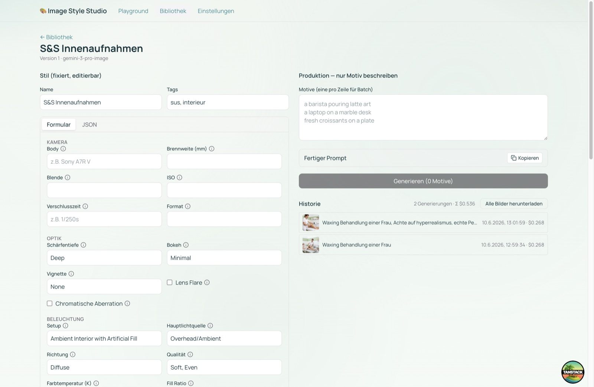

# Image Style Studio

Lokales Tool, um **reproduzierbare Foto-Bildstile** für KI-Bildgenerierung (Gemini 3 Pro
Image / „Nano Banana Pro") zu finden, zu fixieren und konsistent anzuwenden.

**Workflow:** Im *Playground* einen Stil per JSON/Formular finden → als Stil speichern →
in *Produktion* nur noch das Motiv beschreiben → optisch konsistente Bilder. Stile sind über
Tags organisierbar und werden als strukturiertes JSON gespeichert.



> Links wird der Stil als strukturiertes Formular/JSON fixiert (Kamera, Optik, Licht, Farbe …),
> rechts beschreibt man nur noch das Motiv und erzeugt konsistente Varianten. Ergebnisse landen
> in der Historie und öffnen sich in einer Lightbox mit Download:


## Wofür ist das?

KI-Bildmodelle liefern beim selben Prompt jedes Mal einen leicht anderen Look — ein Problem,
sobald man eine **einheitliche Bildsprache** braucht (Blog, Shop, Social Media, Markenauftritt).
Image Style Studio trennt **Stil** von **Motiv**: Du legst den fotografischen Look *einmal* fest
(Kamera, Optik, Licht, Farbe, Stimmung …), speicherst ihn und wendest ihn auf beliebig viele
Motive an — so wirken alle Bilder „wie aus einer Serie", statt zufällig zusammengewürfelt.

**Für wen:** Content-Creator, Marketing- und Social-Media-Teams, Blogger, Shop-Betreiber und
Agenturen — alle, die regelmäßig konsistente, markenkonforme KI-Bilder brauchen, ohne bei jedem
Bild den Prompt neu zu tüfteln.

## Was du damit machen kannst

- **Stile definieren** — den Look als strukturiertes Formular *oder* JSON festlegen: Kamera-Body,
  Brennweite, Blende, Licht-Setup, Farbpalette, Film-Emulation, Stimmung, Negativ-Guards.
- **Stil aus einem Bild ableiten** — ein vorhandenes (Kunden-)Foto hochladen; eine Vision-Analyse
  füllt das Stil-Formular automatisch vor und trifft Marken-Looks schnell.
- **Konsistenz über Anker** — Referenzbilder an einen Stil pinnen; sie werden bei jeder Produktion
  mitgeschickt und heben die optische Konsistenz deutlich an (siehe unten).
- **In Produktion gehen** — gespeicherten Stil wählen, nur noch Motive beschreiben (eine pro Zeile
  = Stapel) und konsistente Varianten erzeugen.
- **Modell wählen** — Google Gemini (Nano Banana Pro) und OpenAI (GPT Image); sind beide API-Keys
  gesetzt, lässt sich das Modell pro Generierung umschalten.
- **Bibliothek** — Stile taggen, durchsuchen, duplizieren und versionieren.
- **Ergebnisse verwalten** — Historie mit Vorschau, Lightbox, Original-Download, Stapel-Download
  als ZIP und Kostenanzeige pro Lauf.
- **Teilen & sichern** — Stile als JSON exportieren und wieder importieren.

### Typische Anwendungsfälle

- Einheitliche **Blog-Header** über viele Artikel hinweg.
- **Produktbilder** im gleichen Studio-Look.
- Eine **Social-Media-Serie** mit wiedererkennbarer Ästhetik.
- Einen **Marken- oder Kunden-Look** schnell treffen — per „Stil aus Bild ableiten".

> Hinweis: Du brauchst einen eigenen API-Key (Google Gemini, optional OpenAI). Generierungen
> laufen über deinen Account und verursachen die jeweiligen Anbieterkosten; die geschätzten
> Kosten pro Lauf werden angezeigt.

## Setup

```bash
npm install
cp .env.example .env        # GEMINI_API_KEY eintragen (https://aistudio.google.com/apikey)
npm run db:push             # SQLite-Schema anlegen
npm run dev                 # http://localhost:3000
```

Den API-Key nach Änderung der `.env` neu laden → Dev-Server neu starten.

## Scripts

| Script | Zweck |
|---|---|
| `npm run dev` | Dev-Server (Vite) |
| `npm run build` / `npm run preview` | Produktions-Build / Vorschau |
| `npm test` | Unit-Tests (Vitest) |
| `npm run test:gen` | Einmaliger End-to-End-Gemini-Test (1 Bild, 1K) |
| `npm run db:push` / `db:studio` | Schema sync / Prisma Studio |

## Architektur

- **TanStack Start** (Vite + Router) + React + TypeScript. Server Functions (`src/server/*`)
  halten den API-Key serverseitig.
- **Prisma + SQLite** (`prisma/schema.prisma`) lokal. Für Team später: Provider auf
  `postgresql` + passenden Driver-Adapter in `src/db.ts`; Modell ist vorbereitet.
- **Provider-Abstraktion** (`src/lib/providers/`): Gemini (`gemini-3-pro-image` via
  `@google/genai`) und OpenAI (`gpt-image-1`/`gpt-image-2` via `openai`) implementiert. Sind beide
  API-Keys gesetzt, wählt man das Modell pro Generierung; Imagen o.Ä. später einsteckbar.
- **Stil-Schema** (`src/lib/schema/photoStyle.ts`, Zod): Single Source of Truth für
  Formular + JSON-Validierung. `looseObject` → eigene JSON-Felder bleiben erhalten.
- **Prompt-Kompilierung** (`src/lib/prompt/compile.ts`): fixiertes Stil-JSON + `subject` →
  Prompt; bei Ankern Stil-Transfer-Anweisung.
- **Storage-Adapter** (`src/lib/storage/`): lokaler Filesystem-Adapter (`data/images`);
  S3/Objekt-Storage später ohne Aufrufer-Umbau.

### Konsistenz-Mechanik
Gemini 3 Pro Image hat **keine Seeds**. Reine Prompts erreichen ~50–65 % Konsistenz.
Der stärkste Hebel sind **Stil-Anker** (Referenzbilder, bis 11): ein gespeicherter Stil pinnt
optional Anker-Bilder, die bei jeder Produktion als Referenz mitgeschickt werden → ~80–95 %.

## Wichtige Implementierungs-Hinweise

- **Prisma/Storage nur dynamisch importieren** (`await import('#/db')`) innerhalb von Server-
  Function-Handlern. Statischer Top-Level-Import leakt Node-Code (`fileURLToPath`) ins
  Client-Bundle und crasht im Browser.
- **Server-Function-Rückgaben müssen serialisierbar sein** — keine `unknown`-Werte. Dafür
  `JsonObject`/DTOs (`src/lib/types.ts`) statt `Record<string, unknown>`.
- SQLite kennt keine Scalar-Arrays → Listen/Objekte liegen als `Json`-Spalten.
